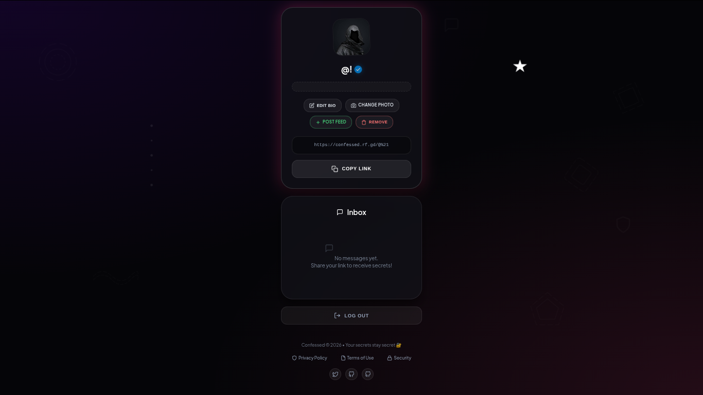

<p align="center">
  
  <br><br>
  <h1 align="center">🤫 confessed</h1>
  <p align="center"><i>say it. send it. forget it.</i></p>
</p>

<p align="center">
  <a href="https://confessed.rf.gd">
    
  </a>
</p>

---

<p align="center">
  
  <br>
  <sub><i>👆 that's what you'll see when you visit 👆</i></sub>
</p>

---

## 🌙 what's this about?

> a safe, anonymous, no-judgment zone for your secrets, thoughts, crushes, regrets, and random late-night feelings.

no stress. no spam. no weird tracking.  
just you, your truth, and a community that gets it.

---

## ✨ why you'll love it

| feature | why it slaps |
|---------|--------------|
| 🔐 **anon mode** | your identity stays locked. always. |
| 💬 **real vibes** | read & feel less alone. real stories, real people. |
| ⚡ **zero friction** | open → signup → type → send. under 30 seconds. |
| 🌍 **shareable** | send the link anywhere. watch the confessions roll in. |
| 💙 **soft space** | built with care, moderated with love. |

---

## 🎮 how to play (aka use it)

```text
1. tap → https://confessed.rf.gd
2. quick signup / login (super fast, we promise) 🔑
3. type what's on your mind 🧠
4. hit send ✈️
5. breathe. you did it.
6. (optional) send the link to a friend & see what they confess 👀
